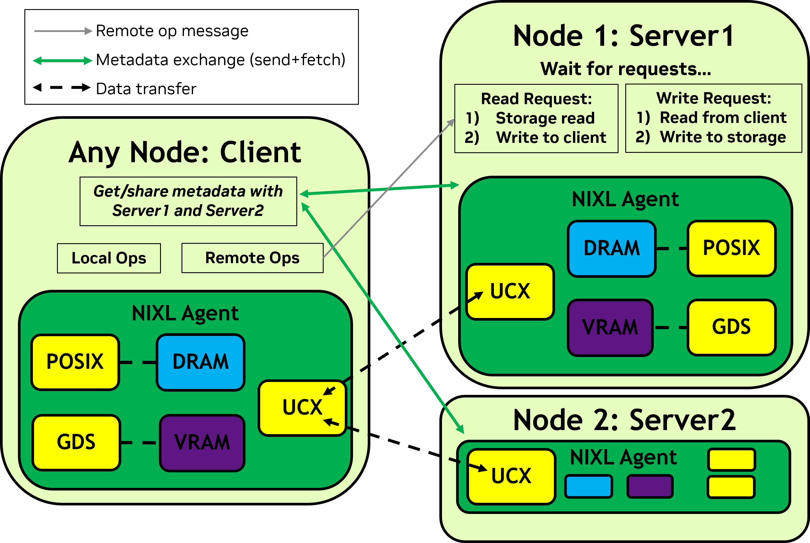

# NIXL Storage Transfer Sample

A high-performance storage transfer system built on NIXL (NVIDIA Inference Xfer Library) that demonstrates local and remote storage operations using POSIX and GDS (GPU Direct Storage) backends.

## Features

- **Flexible Storage Backends**
  - GDS (GPU Direct Storage) support for high-performance transfers
  - POSIX fallback for standard storage operations
  - Automatic backend selection based on availability

- **Transfer Modes**
  - Local memory-to-storage transfers
  - Remote memory-to-storage transfers
  - Bidirectional operations (READ/WRITE)
  - Batch processing support

- **Network Communication**
  - UCX-based data transfer
  - Metadata exchange between nodes
  - Asynchronous notification system

## Project Structure

- `nixl_storage_utils/` - Core module providing storage utilities
  - `__init__.py` - Module initialization and exports
  - `common.py` - Common utilities and shared functionality
- `nixl_p2p_storage_example.py` - Main application that can run as either initiator or target

## Requirements

- Python 3.6+
- NIXL library with the following plugins:
  - GDS (optional)
  - POSIX
  - UCX

## Usage

The system operates in two modes: client and server.

The servers wait for requests from clients so it can READ/WRITE from its storage to a remote node.

The initiator initiates transfers and can perform both local and remote operations with storage servers.

### Running as Client

```bash
python nixl_p2p_storage_example.py --role client \
                      --agents_file <file path> \
                      --fileprefix <path_prefix> \
                      --agent_name <name> \
                      [--buf_size <size>] \
                      [--batch_size <count>]
```

Role specifies client or server. The agents file is a list of storage servers you want the client to connect to.

The agents file should have agents separated by line, with "<agent name> <ip address> <port>" on each line.

File prefix lets you specify a path to run local storage transfers on.

Agent name is the name you want to give the NIXL agent on this client.

You can optionally specifically buf_size and batch_size to change how much data is transferred.

### Running as Server

```bash
python nixl_p2p_storage_example.py --role server \
                      --fileprefix <path_prefix> \
                      --agent_name <name> \
                      [--buf_size <size>] \
                      [--batch_size <count>]
```

Parameters are same as before, but names must match what is in the client agents file.

Additionally, buf_size and batch_size must match what the client specifies.

## Architecture



### Storage Module

The `nixl_storage_utils` module provides core functionality:
- Agent creation and plugin management
- Memory and file resource handling
- Transfer state monitoring
- Common utilities and configuration

### Storage Backends

The system automatically selects the best available storage backend:
1. Prefers GDS when available for high-performance GPU-direct storage operations
2. Falls back to POSIX when GDS is unavailable
3. Requires at least one storage backend to operate

### Transfer Process

#### Local Transfers
1. Register memory and file descriptors
2. Perform direct memory-to-storage transfers
3. Support both read and write operations

#### Remote Transfers
1. Initiator sends memory descriptors to target
2. Target performs storage-to-memory or memory-to-storage operations
3. Data is transferred between initiator and target memory
